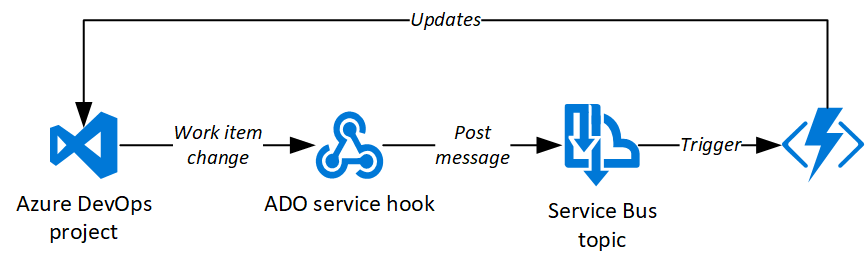
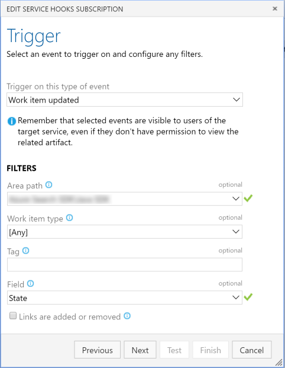
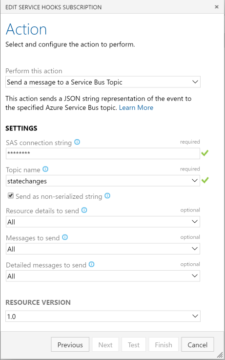

# Description
This project automates Azure DevOps to update work item state in two frequent scenarios:
* When a work item transitions from New to Active, recursively walk parent links and update parent items from New to Active; 
  if parent items are in any other state, no change is made.
* When the last child item of a work item transitions to Closed or Removed, change the work item itself to Closed (if at least one child is Closed)
  or Removed (if all child items are Removed); if any of the child items is not in the Closed or Removed date, no change is made.
  
# How it's done
A Service Hook in Azure DevOps sends a message to a ServiceBus topic every time a work item is updated (see configuration screenshots below).
This topic triggers an Azure function which connects to the Azure DevOps project and implements the logic above, using the ADO REST API (through
the respective C# SDK).

# How to reuse
1. [Create a Personal Access Token](https://docs.microsoft.com/en-us/azure/devops/organizations/accounts/use-personal-access-tokens-to-authenticate?view=azure-devops)
in Azure Dev Ops with "Work Items (Read, write, & manage)" permissions
1. Open AdoAutoStateTransitions.sln in Visual Studio
1. Deploy the azuredeploy.json ARM template in the AdoAutoStateTransitionsAzure project
1. Build and publish the Azure Functions project (AdoAutoStateTransitionsFunctions)
1. Go to the Properties page for the Function App in the Azure portal and set the appropriate values for the AdoUrl, AdoPat
and ServiceBusConnectionString settings

# Contributing
Feedback and pull requests welcome.
